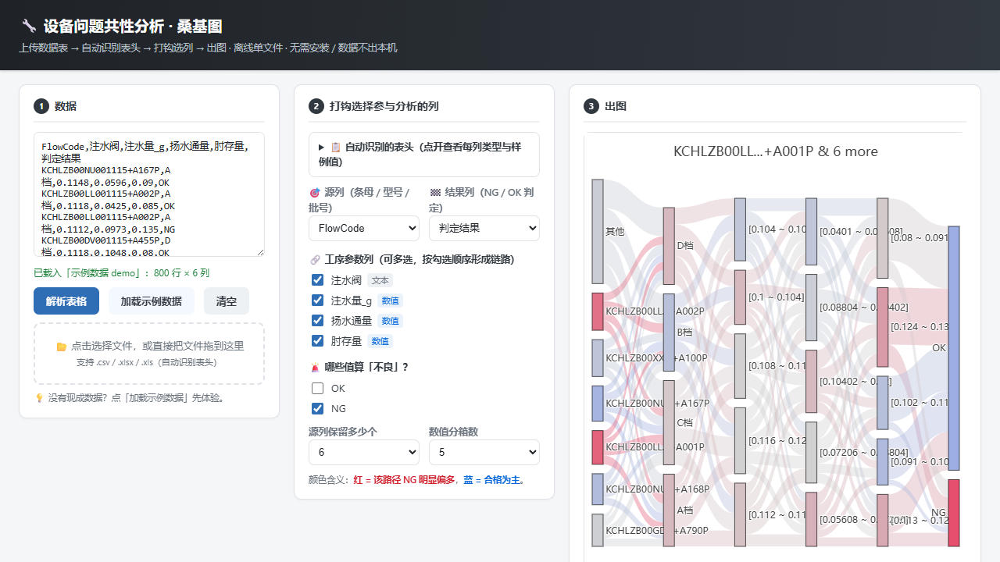

# 设备问题共性分析 · 桑基图

> 一个面向制造业数据处理场景的"桑基图(Sankey)"可视化工具。
> 帮你一眼看清**设备问题集中在哪个工艺参数、哪个组合最容易 NG**。

<div align="center">

[](https://gtx950l.github.io/equipment-failure-commonality/)

</div>



---

## 🚀 在线使用（推荐）

**浏览器直接打开，不用安装、不用下载：**

👉 **[https://gtx950l.github.io/equipment-failure-commonality/](https://gtx950l.github.io/equipment-failure-commonality/)**

1. 把包含**各种表头**的数据表（CSV / Excel）拖进页面，或直接粘贴
2. 自动识别表头，展示每列的**类型 / 唯一值数 / 样例值**
3. **半自动识别，几乎不用点**：
   - 源列（料号 / 条码 / 型号）与结果列（判定）自动推荐
   - 「不良」值自动识别（NG / FAIL / 不良…，多值取少数派）
   - 工序参数列**默认全部不打勾**，按需手动勾选要分析的列
4. 一键出图 + CPK 联合分析

**出图能力**：每层标注字段名（X 轴层标题）、节点 hover 显示 NG 占比/样本数/完整取值、
配色可切换（科学渐变 / JMP 红蓝二色）、导出 PNG / SVG 矢量图、点击节点路径高亮 + 筛选 + CPK。

> 数据始终只在你的**浏览器内**处理，不会上传到任何服务器。

---

## 离线使用（可选）

没有网络时，把仓库根目录的文件（`index.html`、`sankey.html`、`sankey_core.js`、`demo_data.js`、`lib/`）拷走，双击 `sankey.html`（或 `index.html`）即可——功能与在线版完全一致。
前提是保持 `lib/` 子目录与 HTML 文件在同一文件夹里，不能只拷一个 HTML 文件。

---

## 这是什么？

在流水线（汽车/家电/3C 制造）上，每天会产生大量质量数据：
一条产品从 **条码 / 料号** 出发，经过若干道工序（**注水阀、注水量、除气真空值、封存量…**），
最后落到 **PASS / FAIL** 两个结果。

传统表格只能告诉你"FAIL 率 4.4%"，但你更想知道的是：

- **FAIL 主要集中在哪些条码 / 料号？**
- **注水阀打到哪个档位最容易 FAIL？**
- **问题参数组合是哪个？（比如"注水阀 1 档 + 注水量低于 0.11"是不是 80% 都 FAIL）**

**桑基图**就是用来回答这类"路径共性"的：
每条流是一台设备的工艺路径，颜色越红 = 这条路径越偏向 FAIL，蓝 = PASS，中间色 = 介于两者之间。

---

## 一张图看懂

```
条码 → 注水阀 → 注水量 → 除气真空值 → 封存量 → PASS / FAIL
   │           │         │          │          │        │
   ▼           ▼         ▼          ▼          ▼        ▼
 红色节点 = 该条码 FAIL 多   ........   最终汇聚到 PASS/FAIL 两端
```

> 颜色编码：节点 / 链路按"该节点下游 FAIL 占比"染色 (0%~100%)。
> 也就是说：看一根红线从哪儿开始分叉 → 那就是问题的根因。

---

## 目录结构

```
equipment-failure-commonality/
├── README.md
├── .gitignore
├── index.html                    # 入口 (自动跳转到 sankey.html)
├── sankey.html                   # 主界面
├── sankey_core.js                # 核心计算逻辑 (JS)
├── demo_data.js                  # 内置示例数据 (800 条真实记录, 供"加载示例数据"按钮)
├── lib/
│   ├── plotly.min.js             # 本地绘图库 (离线可用)
│   └── xlsx.full.min.js          # 本地 Excel 解析库
├── test_core.js                  # 核心逻辑自测 (node test_core.js)
└── docs/
    └── sankey_web_example.png        # 静态预览图 (网页截图)
```

---

## 数据格式

内置示例数据（`demo_data.js`，取 9610 线真实导出前 800 行）列定义（把窗口里的示例换成你自己的数据即可）：

| 列名          | 含义                            | 样例                      |
|---------------|---------------------------------|---------------------------|
| `料号`         | 产品型号                        | `M0V405N00D-1`            |
| `条码`         | 产品条码（源列）                | `KJCHUZB01RU0001T1D+A466P`|
| `测试时间`     | 测试时间                        | `2026-08-09 09:20:30`     |
| `测试结果`     | 终检结果（结果列）              | `PASS` 或 `FAIL`          |
| `注水阀`       | 工序：阀门档位（离散）          | 1 / 2 / 3 / 4             |
| `注水量-g`     | 注水数值（连续）                | 0.1108                    |
| `除气真空值`   | 除气真空度（连续）              | 0.0814                    |
| `封存量`       | 封存液量数值（连续）            | 0.1035                    |

> 列名**不需要**保持一致 —— 上面只是 demo 数据的列名。Web 版会自动识别表头让你打钩选择，
> 任意表头 / 任意参数列组合都能跑。

---

## 代码走读（5 分钟看懂）

Web 版 `sankey_core.js` 的核心流水线：

| 步骤 | 函数 / 代码块                              | 作用                                  |
|------|---------------------------------------------|---------------------------------------|
| 1    | `prepareLayer`                              | 自动判断数值/离散列：连续值分箱 (`0.108` → `[0.105, 0.110]`)，离散列合并低频类别为"其他" |
| 2    | 逐层统计共现次数 (source→target 计数)        | 任意数量参数列，逐层统计共现次数 (链路 value) |
| 3    | `colorForNode` / `colorForLink`             | 按"相对基线 NG 占比"计算节点 / 链路颜色 |
| 4    | `buildSankey`                               | 组装节点 / 链路数组，喂给 Plotly 出图   |

核心入口是 `buildSankey({ data, sourceCol, paramCols, resultCol, ... })` —— 参数列是**数组**，传几个就有几层。
配套 `scoreColumns`（按信息增益自动推荐参数列）与 `calcCpK` / `verdictForCpk`（CPK 判级）。

---

## 替换成你自己的数据

1. 打开页面后，把数据表 **拖进窗口** 或 **粘贴**（CSV / Excel 均可）
2. 确认自动识别的源列 / 结果列 / 不良值，勾选要分析的工序参数列
3. 点「生成桑基图」即可

想先体验效果？点页面上的「加载示例数据」按钮，内置 800 条 9610 线真实导出记录（33 列，含注水 / 除气全工序参数）。

---

## 联合分析：FACA 共性 + CPK 能力

Web 版内置了 **CPK 过程能力分析**面板（一键闭环），回答"红色路径的参数到底是不是根因"：

1. 出图后，**点击图上任意节点**（红色型号 / 参数区间 / NG 结果层）→ 自动筛选出该子集
2. 下方 CPK 面板弹出**对比表**：全量 / 当前筛选 / 仅 OK / 仅 NG 的 Cpk 一目了然
3. 配合规格限 LSL / USL，判断子集过程能力是否真正不足

判定逻辑（与 [cpk_calculator.html](https://github.com/GTX950L/cpk-jmp-studio) 的 A/B/C/D 一致）：

| Cpk | 等级 | 含义 |
|-----|------|------|
| ≥ 1.67 | A · 优秀 | 过程能力富足 |
| ≥ 1.33 | B · 合格 | 满足工业要求 |
| ≥ 1.00 | C · 边缘 | 存在超规风险 |
| < 1.00 | D · 不足 | **超规风险高，很可能是系统性根因** |

**典型判读**：
- 当前筛选子集 Cpk **D 级** ←→ 桑基图红色 → 红色路径参数确实是根因（调工艺）
- 当前筛选子集 Cpk **A/B 级** ←→ 桑基图红色 → 参数没问题，NG 另有其因（查批次/操作员/时段）
- Cpk 接近 Cpk 但 Cp 明显低 → 波动大（一致性差）→ 设备精度 / 材料批次问题

CPK 面板的「仅 OK / 仅 NG」两个选项是个 1 键验证：

```
"仅 NG" 子集 Cpk 低 + "仅 OK" 子集 Cpk 高
   →  该参数确实把 NG 样本拉偏了 —— 直接调工艺参数
```

规格限 LSL / USL 留空时自动用全量 μ±3σ 占位（仅试算），正式判级请填图纸/客户标准的真实值。

---

## 适用场景

这个模板适合所有"**沿工序链路的 NG / OK 共性分析**"，举几个例子：

- 注塑 / 压铸：原料型号 → 注塑参数 → 冷却参数 → 终检
- SMT 贴片：板号 → 贴片机 → 回流焊温度 → AOI
- 电池组装：电芯批号 → 注液量 → 化成参数 → 容量测试
- 纺织：纱线批号 → 织机参数 → 后整理 → 色牢度

只要你的数据是 **(设备型号/批号) → (若干工序参数) → (NG / OK)** 这条结构，都可以直接套。

---

## 方法论：FACA

这个思路借鉴制造业常用的 **FACA (Failure Analysis Commonality Analysis)**：

> 找出"问题样本" (NG) 共同具有的特征 → 锁定是"系统性根因"还是"特殊原因"。

桑基图只是其中一种很直观的呈现方式——你也能把它换成 **决策树** (例如
`scikit-learn` 的 `DecisionTreeClassifier`) 来得到"哪些参数组合最可能 NG"。

本仓库专注可视化层，模型层不展开，留给后续项目。

---

## 依赖

- 浏览器即可（Chrome / Edge / Firefox），**无需安装任何东西**
- 绘图库 Plotly.js 与 Excel 解析库 SheetJS 已内置在 `lib/`，完全离线可用
- 跑自测 `node test_core.js` 仅需 Node.js（开发验证用，不影响使用）

---

## 路线图

- [x] 内置示例数据 (800 条, 一键加载)
- [x] 桑基图核心 (任意参数列组合, 不再写死 5 层)
- [x] Web 离线版 (双击即用, 自动识别表头 + 打钩选列)
- [x] 本地 Plotly.js / SheetJS (完全离线可用)
- [x] FACA + CPK 联合分析面板 (节点点击 → 子集筛选 → Cpk 对比)
- [ ] 支持更多结果值（A/B/C 等级、不良原因分类等）

---

## License

MIT — 拿去用，改，卖，都欢迎。
