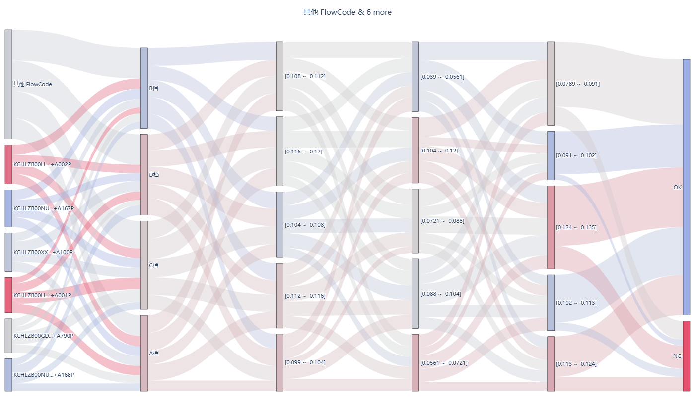

# 设备问题共性分析 · 桑基图

> 一个面向制造业数据处理场景的"桑基图(Sankey)"可视化模板。
> 帮你一眼看清**设备问题集中在哪个工艺参数、哪个组合最容易 NG**。



---

## 这是什么？

在流水线（汽车/家电/3C 制造）上，每天会产生大量质量数据：
一条产品从 **原料型号 (FlowCode)** 出发，经过若干道工序（**注水阀、注水量、扬水通量、肘存量…**），
最后落到 **NG / OK** 两个结果。

传统表格只能告诉你"NG 率 8%"，但你更想知道的是：

- **NG 主要集中在哪些 FlowCode？**
- **注水阀打到哪个档位最容易 NG？**
- **问题参数组合是哪个？（比如"DV 系列 + C 档 + 注水量低于 0.108"是不是 80% 都 NG）**

**桑基图**就是用来回答这类"路径共性"的：
每条流是一台设备的工艺路径，颜色越红 = 这条路径越偏向 NG，蓝 = OK，中间色 = 介于两者之间。

---

## 一张图看懂

```
FlowCode → 注水阀 → 注水量 → 扬水通量 → 肘存量 → NG / OK
   │           │         │          │          │        │
   ▼           ▼         ▼          ▼          ▼        ▼
 红色节点 = 该型号 NG 多   ........   最终汇聚到 NG/OK 两端
```

> 颜色编码：节点 / 链路按"该节点下游 NG 占比"染色 (0%~100%)。
> 也就是说：看一根红线从哪儿开始分叉 → 那就是问题的根因。

---

## 快速开始

零基础也能跑通。

```bash
# 1. 克隆仓库
git clone https://github.com/GTX950L/equipment-failure-commonality.git
cd equipment-failure-commonality

# 2. 安装依赖 (建议 Python 3.10+)
pip install -r requirements.txt

# 3. 跑一遍 demo 数据
python src/generate_demo_data.py

# 4. 生成桑基图 (HTML 交互式, 会自动弹浏览器 / 也可直接打开 examples/sankey_demo.html)
python src/sankey_analysis.py
```

输出：
- `examples/sankey_demo.html` — 交互式桑基图，鼠标悬停看样本数
- 控制台打印每层链接的样本数

命令行参数：

```bash
# 保留数量最多的 8 个 FlowCode, 连续值分 6 箱, 同时导出 PNG
python src/sankey_analysis.py --top-n 8 --bins 6 --out-png docs/sankey_example.png
```

---

## 目录结构

```
equipment-failure-commonality/
├── README.md
├── requirements.txt
├── .gitignore
├── data/
│   └── demo_equipment_issues.csv      # 示例数据 (800 条模拟设备工艺记录)
├── src/
│   ├── generate_demo_data.py         # 生成模拟数据
│   └── sankey_analysis.py            # 核心: 读取 CSV → 桑基图
├── examples/
│   └── sankey_demo.html              # 运行后产出 (git 忽略)
└── docs/
    └── sankey_example.png            # 静态预览图
```

---

## 数据格式

`data/demo_equipment_issues.csv` 列定义（直接换成你自己的数据即可）：

| 列名          | 含义                            | 样例                      |
|---------------|---------------------------------|---------------------------|
| `FlowCode`    | 条母 / 产品型号 / 批次号        | `KCHLZB00DV001115+A455P`  |
| `注水阀`       | 工序 1：阀门档位（离散）         | A 档 / B 档 / C 档 / D 档 |
| `注水量_g`     | 工序 2：注水数值（连续）         | 0.108                     |
| `扬水通量`     | 工序 3：流量数值（连续）         | 0.085                     |
| `肘存量`       | 工序 4：肘部存量数值（连续）     | 0.110                     |
| `判定结果`     | 终检结果                        | `NG` 或 `OK`              |

> **列名必须保持一致**。如果你的列名是英文，把 `src/sankey_analysis.py` 里
> `work.groupby(...)` 的列名同步改一下即可（已在代码里集中标注，方便改）。

---

## 代码走读（5 分钟看懂）

`src/sankey_analysis.py` 的核心流水线只有 5 步：

| 步骤 | 函数 / 代码块                          | 作用                                  |
|------|----------------------------------------|---------------------------------------|
| 1    | `bin_continuous`                       | 连续值分箱 (例: `0.108` → `[0.105, 0.110]`) |
| 2    | `work["FlowCode"].where(...)`          | 数量少的型号合并成 "其他 FlowCode"     |
| 3    | `groupby([left, right]).size()` ×5 层   | 统计每两个相邻层的共现次数 (即链路 value) |
| 4    | `_mix_color` / `_color_for_link`       | 按 NG 占比计算节点 / 链路颜色          |
| 5    | `go.Sankey(...)`                       | 喂给 Plotly 出图                       |

如果你想扩展（不是 5 层、是 N 层），只要复制第 3 步的 `_layer()` 即可。

---

## 替换成你自己的数据

```python
# 在你自己的脚本里
import pandas as pd
from src.sankey_analysis import build_sankey

df = pd.read_csv("your_data.csv")  # 只要列名一致
fig = build_sankey(df, top_n_flowcodes=6, continuous_bins=5)
fig.write_html("your_sankey.html")
fig.show()
```

或者更简单：把 `your_data.csv` 放到 `data/`，命令行指定路径：

```bash
python src/sankey_analysis.py --csv data/your_data.csv --out-html examples/your.html
```

---

## 适用场景

这个模板适合所有"**沿工序链路的 NG / OK 共性分析**"，举几个例子：

- 注塑 / 压铸：原料型号 → 注塑参数 → 冷却参数 → 终检
- SMT 贴片：板号 → 贴片机 → 回流焊温度 → AOI
- 电池组装：电芯批号 → 注液量 → 化成参数 → 容量测试
- 纺织：纱线批号 → 织机参数 → 后整理 → 色牢度

只要你的数据是 **(设备型号/批号) → (若干工序参数) → (NG / OK)** 这条结构，都可以直接套。

---

## 方法论：FACA

这个思路借鉴制造业常用的 **FACA (Failure Analysis Commonality Analysis)**：

> 找出"问题样本" (NG) 共同具有的特征 → 锁定是"系统性根因"还是"特殊原因"。

桑基图只是其中一种很直观的呈现方式——你也能把它换成 **决策树** (例如
`scikit-learn` 的 `DecisionTreeClassifier`) 来得到"哪些参数组合最可能 NG"。

本仓库专注可视化层，模型层不展开，留给后续项目。

---

## 依赖

- Python ≥ 3.10
- pandas ≥ 2.0
- plotly ≥ 5.18
- (可选) kaleido — 用于导出 PNG

见 `requirements.txt`。

---

## 路线图

- [x] demo 数据生成器
- [x] 桑基图核心 (FlowCode → 4 工序 → NG/OK)
- [ ] 支持中文 / 英文图例切换
- [ ] 自动导出 PNG 到 docs/
- [ ] 支持任意层数 (用户自定义工序)
- [ ] 增加"指定 NG 子集分析"模式 (只看 NG 样本的路径)

---

## License

MIT — 拿去用，改，卖，都欢迎。
